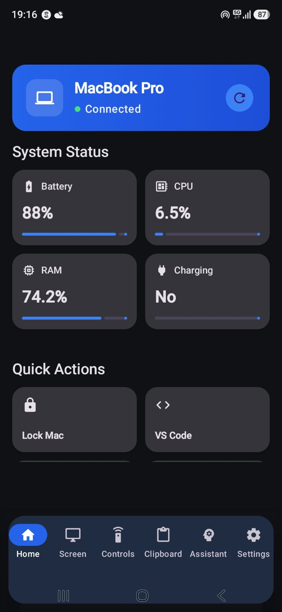
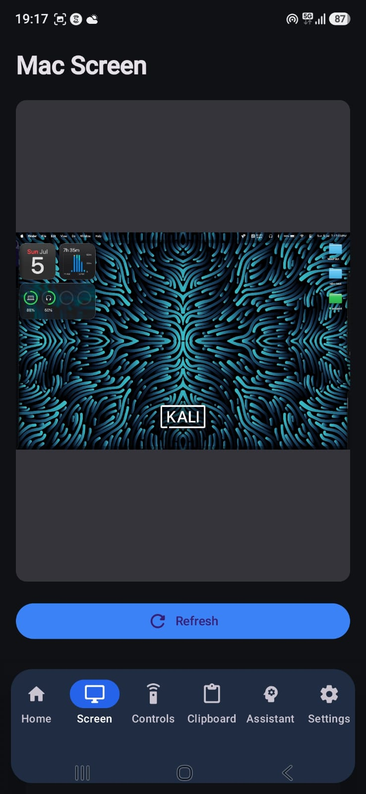
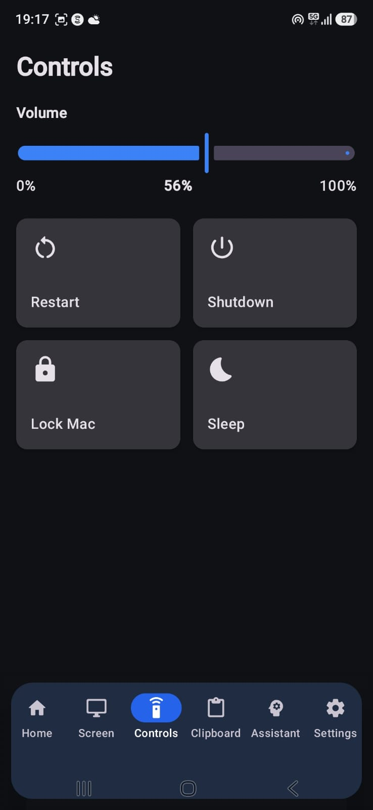
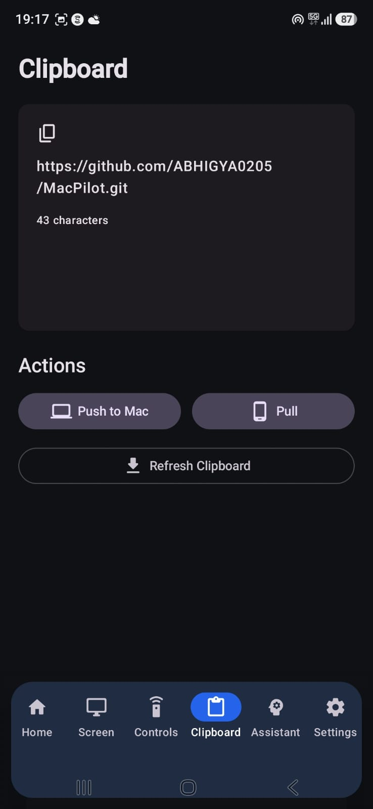
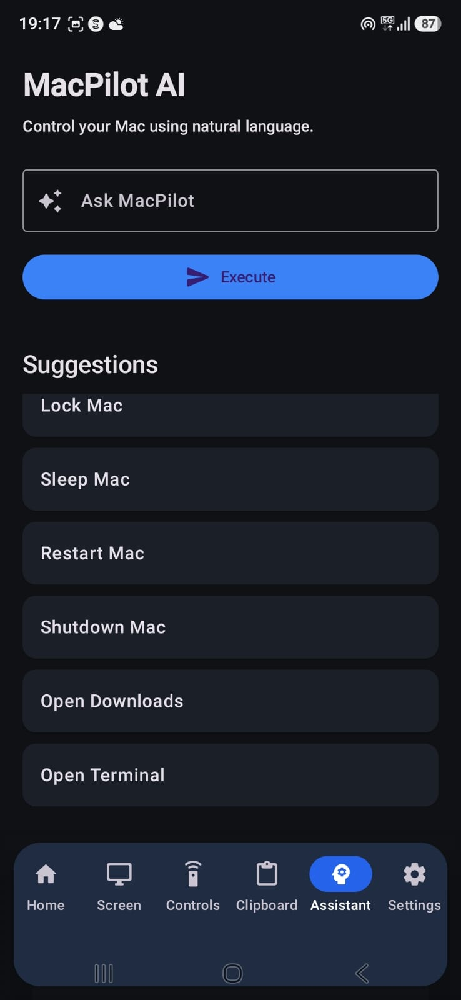
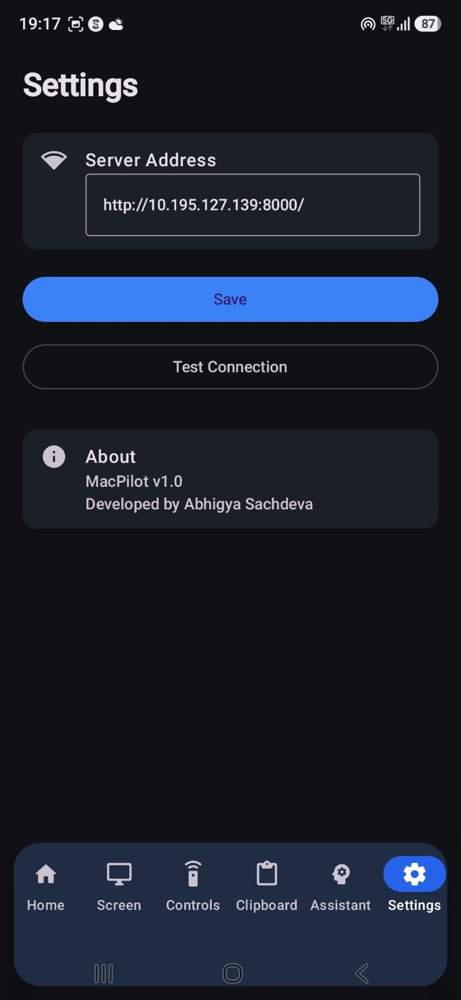

# 💻 MacPilot

MacPilot is an Android application that allows you to remotely monitor and control your Mac from anywhere over Wi-Fi or Tailscale.

Built using **Jetpack Compose** for Android and **FastAPI** for the backend, MacPilot provides a secure and responsive remote desktop companion for everyday tasks.

---

## ✨ Features

### 📊 Dashboard
- Live system status
- Battery percentage
- CPU usage
- RAM usage
- Charging status
- Connection status

### 🖥 Live Screen
- View your Mac's current screen
- Refresh on demand
- Privacy notification shown on the Mac whenever a screenshot is requested

### 🎮 Remote Controls
- Lock Mac
- Sleep
- Restart (with confirmation)
- Shutdown (with confirmation)
- Volume slider (0–100)

### 📋 Clipboard Sync
- Push clipboard from Android → Mac
- Pull clipboard from Mac → Android
- One-click synchronization

### 🤖 AI Assistant
Control your Mac using natural language.

Examples:

- Open Chrome
- Open Brave
- Open VS Code
- Open Terminal
- Lock Mac
- Sleep Mac
- Restart Mac
- Shutdown Mac
- Open Downloads

### 🌐 Remote Connectivity
- Local Wi-Fi support
- Dynamic IP configuration
- Tailscale support for remote access from anywhere

### 🔒 Security
- API Key authentication
- Screenshot notifications
- Confirmation dialog for dangerous actions

---
<h2>📱 Screenshots</h2>

<table align="center">
<tr>
    <td align="center"><b>Dashboard</b></td>
    <td align="center"><b>Live Screen</b></td>
    <td align="center"><b>Controls</b></td>
  </tr>
  <tr>
    <td align="center">
      <a href="screenshots/dashboard.jpeg">
        
      </a>
    </td>
    <td align="center">
      <a href="screenshots/screen.jpeg">
        
      </a>
    </td>
    <td align="center">
      <a href="screenshots/controls.jpeg">
        
      </a>
    </td>
  </tr>

  

  <tr>
    <td align="center">
      <a href="screenshots/clipboard.jpeg">
        
      </a>
    </td>
    <td align="center">
      <a href="screenshots/assistant.jpeg">
        
      </a>
    </td>
    <td align="center">
      <a href="screenshots/settings.jpeg">
        
      </a>
    </td>
  </tr>

  <tr>
    <td align="center"><b>Clipboard</b></td>
    <td align="center"><b>AI Assistant</b></td>
    <td align="center"><b>Settings</b></td>
  </tr>
</table>

---

# 🏗 Architecture

```
                Android App
                     │
         Retrofit + REST API
                     │
             FastAPI Server
                     │
      ┌──────────────┴──────────────┐
      │                             │
 macOS System APIs           AppleScript
      │                             │
 Clipboard   Volume   Apps   Screenshot
```

---

# 🛠 Tech Stack

## Android

- Kotlin
- Jetpack Compose
- Material 3
- Retrofit
- Kotlin Coroutines
- DataStore
- Coil

## Backend

- Python
- FastAPI
- Uvicorn
- Pydantic
- psutil
- AppleScript
- macOS Terminal Commands

---

# 🚀 Installation

## Backend

Clone the repository

```bash
git clone https://github.com/ABHIGYA0205/MacPilot.git
```

Go to the server

```bash
cd server
```

Create virtual environment

```bash
python3 -m venv venv
```

Activate

```bash
source venv/bin/activate
```

Install dependencies

```bash
pip install -r requirements.txt
```

Create a `.env`

```env
API_KEY=your-secret-api-key
```

Run

```bash
uvicorn main:app --host 0.0.0.0 --port 8000
```

---

## Android

Open the **android** folder in Android Studio.

Update the server IP inside the app or use the Settings screen.

Run on your Android device.

---

# 📂 Project Structure

```
MacPilot/

│
├── android/
│   ├── screens/
│   ├── components/
│   ├── navigation/
│   ├── repository/
│   ├── network/
│   └── viewmodel/
│
├── server/
│   ├── main.py
│   ├── requirements.txt
│   ├── start_server.sh
│   └── .env
│
└── README.md
```

---

# 🔐 Security

MacPilot uses:

- API Key authentication
- Local network or Tailscale connectivity
- Confirmation dialogs for destructive actions
- Screenshot notifications on macOS

---

# Future Improvements

- File Transfer
- Multiple paired Macs
- Remote terminal
- Notifications
- Media controls
- Screen streaming
- Touchpad mode
- End-to-end encryption
- Biometric authentication

---

# Author

**Abhigya Sachdeva**

GitHub:
https://github.com/ABHIGYA0205

LinkedIn:
https://www.linkedin.com/in/abhigya-sachdeva-2a260a386/

---

# License

MIT License